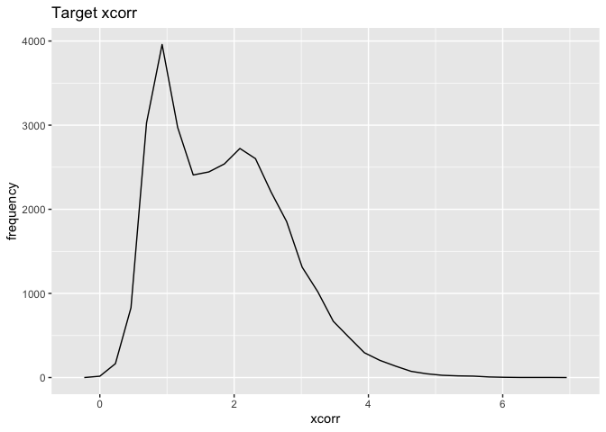
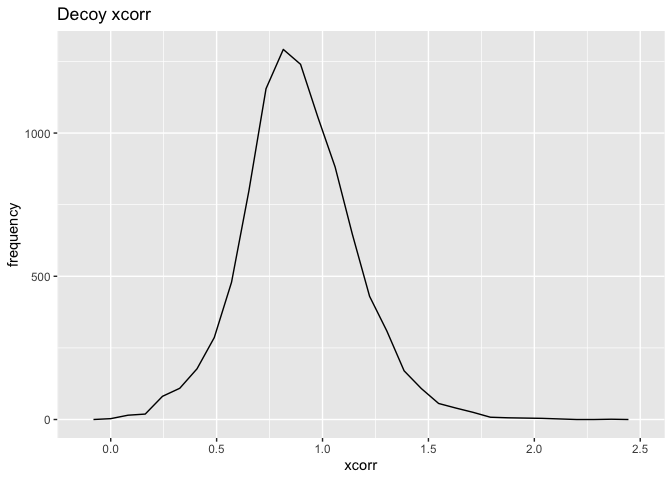
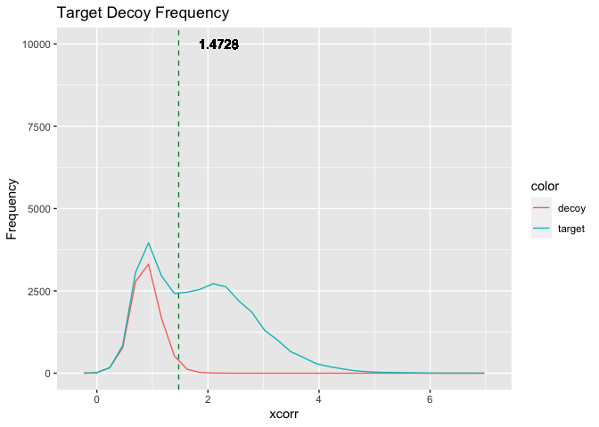
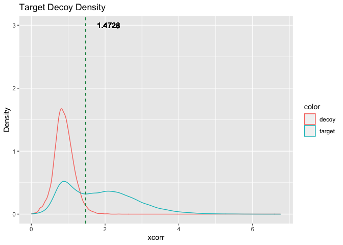
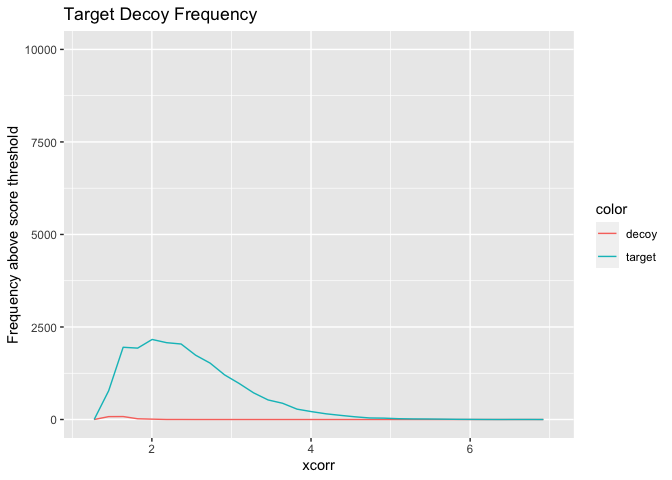

data_process_reverse
================
Hyeyun Jung

``` r
library(ggplot2)
require(gridExtra)
```

    ## Loading required package: gridExtra

``` r
library(readr)
```

### Load Data Files

``` r
target  <- read_csv("reverse/target_rev.csv", show_col_types = FALSE)
```

    ## New names:
    ## * `` -> ...1

``` r
decoy  <- read_csv("reverse/decoy_rev.csv", show_col_types = FALSE)
```

    ## New names:
    ## * `` -> ...1

``` r
threhold_subset <- read_csv("reverse/threshold_all_r.csv", show_col_types = FALSE)
```

    ## New names:
    ## * `` -> ...1

``` r
threshold_target<- read_csv("reverse/threshold_target_r.csv", show_col_types = FALSE)
```

    ## New names:
    ## * `` -> ...1

``` r
threshold_decoy<- read_csv("reverse/threshold_decoy_r.csv", show_col_types = FALSE)
```

    ## New names:
    ## * `` -> ...1

### Draw Plots (Target & Decoy)

``` r
threshold <- min(threhold_subset$xcorr) # get the threshold value

target_plt <- ggplot(target, aes(x=xcorr)) +
  geom_freqpoly()+
  ggtitle("Target xcorr") + xlab("xcorr") + ylab("frequency") 
show(target_plt)
```

    ## `stat_bin()` using `bins = 30`. Pick better value with `binwidth`.

<!-- -->

``` r
decoy_plt <- ggplot(decoy, aes(xcorr)) +
  geom_freqpoly()+
  ggtitle("Decoy xcorr") + xlab("xcorr") + ylab("frequency")  
show(decoy_plt)
```

    ## `stat_bin()` using `bins = 30`. Pick better value with `binwidth`.

<!-- -->

### Draw Combined Plots (Target + Decoy + Threshold)

``` r
df <- rbind(data.frame(color = "target", xcorr = target$xcorr),
                   data.frame(color = "decoy",xcorr = decoy$xcorr))

freq_plt <- ggplot(df) +
  geom_freqpoly(aes(x=xcorr,color=color),linewidth = 0.8) +
  ggtitle("Target Decoy Frequency") + xlab("xcorr") + ylab("Frequency") +
  geom_vline(xintercept = threshold, linetype="dashed", color = "springgreen4", linewidth = 1)+
  geom_text(aes(threshold, 10000, label = threshold, hjust = -0.5))
```

    ## Warning: Ignoring unknown parameters: linewidth

    ## Warning: Ignoring unknown parameters: linewidth

``` r
show(freq_plt)
```

    ## `stat_bin()` using `bins = 30`. Pick better value with `binwidth`.

<!-- -->

``` r
density_plt <- ggplot(df) +
  geom_density(aes(x=xcorr,color=color), linewidth = 0.8) +
  ggtitle("Target Decoy Density") + xlab("xcorr") + ylab("Density") +
  geom_vline(xintercept = threshold, linetype="dashed", color = "springgreen4", linewidth = 1)+
  geom_text(aes(threshold, 3, label = threshold, hjust = -0.5))
```

    ## Warning: Ignoring unknown parameters: linewidth

    ## Warning: Ignoring unknown parameters: linewidth

``` r
show(density_plt)
```

<!-- -->

### Draw Plots Beyond Threshold

``` r
df_thres <- rbind(data.frame(color = "target", xcorr = threshold_target$xcorr),
                  data.frame(color = "decoy",xcorr = threshold_decoy$xcorr))

thres_freq_plt <- ggplot(df_thres) +
  geom_freqpoly(aes(x=xcorr,color=color),linewidth = 0.8) +
  ggtitle("Target Decoy Frequency") + xlab("xcorr") + ylab("Frequency above score threshold")+ ylim(0,10000) 
```

    ## Warning: Ignoring unknown parameters: linewidth

``` r
show(thres_freq_plt)
```

    ## `stat_bin()` using `bins = 30`. Pick better value with `binwidth`.

<!-- -->
